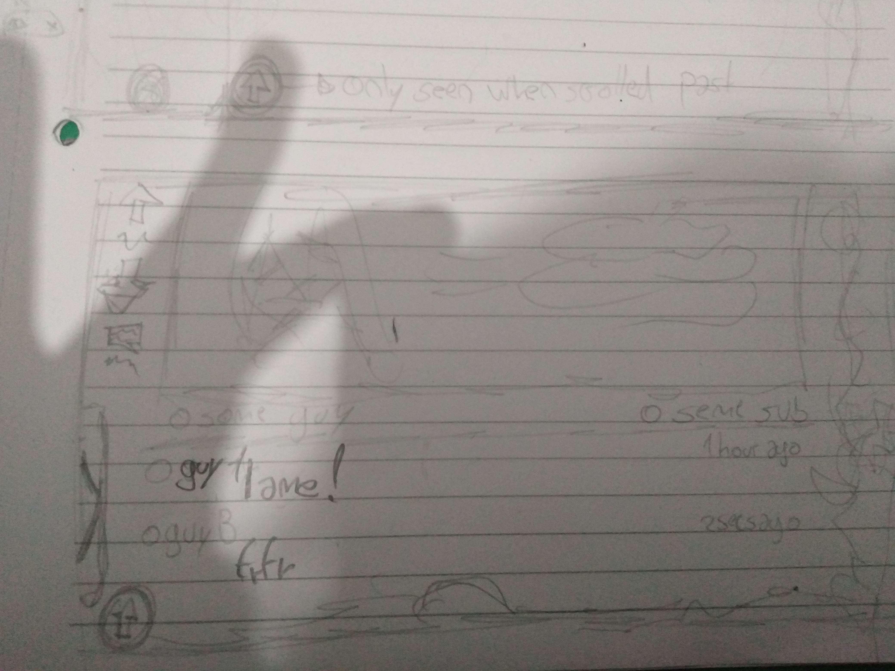
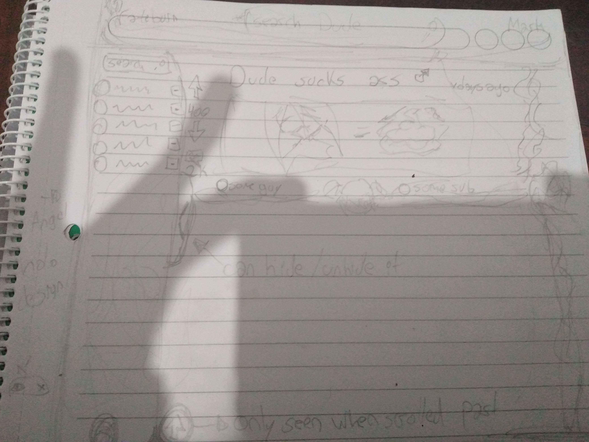

# Fateburn Mark

**Fateburn Mark** is a React-powered web app I put together to make browsing Reddit a bit less soul-crushing. It’s got a clean, intentionally structured layout broken into three main zones: the Left-Bar, Main-Area, and Top-Bar. Each one does something useful, so you're not just wading through chaos.  
Also, yes—the vaguely stylish UI diagrams? Those are mine too. Naturally.

---

## Main Components

### Left-Bar  
This is your command center. It handles navigation and lets you tell the app where to point its face. Inside:

- **SubSearch**: Lets you hunt down subreddits and add them to your list, because typing out `/r/whatever` in 2025 feels archaic.
- **SubList**: Displays the subreddits you've saved, plus search results. Each one has a button to either pin it to your favorites or banish it forever. The *Home* item up top lets you see posts from all your saved subs in one blended feed, so you’re not jumping around like a Reddit-addled kangaroo.

- There’s also a toggle to hide the whole Left-Bar if you want a more minimal vibe (or just hate sidebars).

---

### Main-Area  
This is where all the actual Reddit stuff lives and breathes. It reacts to what you're doing and swaps views accordingly:

- **PostList**: Displays an endless scroll of posts from your chosen sub(s). Comes with loading states, error handling, the usual niceties.
- **Post**: When you click into a post, this shows all the gritty details—title, body, media (yes, even galleries), author, subreddit, and a mock vote system that makes you *feel* like you're participating in the chaos (but you're not actually poking Reddit’s API).
- **Comments**: Click the post title or comment icon and you’ll see the comment thread pop in, complete with nested replies, usernames, and scores. No mock voting here—just raw, unfiltered Reddit noise.

- It seamlessly flips between the feed view and the deep-dive post+comments view depending on what you select.
- There’s a quick “To Top” button to zip you back up the list without all that furious scrolling.

### Top-Bar  
The Top-Bar handles the surface-level glam: branding and search.  
- Shows off the **Fateburn Mark** logo and title—subtle ego stroke included.  
- Packs a Search component that hooks into the same logic as SubList, so your search results actually respect what you’ve got selected. It’s smart enough to know where to dig.

---

## State Management  
All the moving pieces—posts, comments, subreddits, search queries—are wrangled using Redux Toolkit. It keeps the state tidy and predictable across components, so nothing randomly explodes (most of the time).

---

## Testing  
I used Jest and React Testing Library to cover the usual suspects: key user flows and how the components behave. It’s not exhaustive, but it gets the job done and doubles as living documentation—useful for both future me and any poor soul poking around later.

---

## Summary  
Fateburn Mark is a full-featured Reddit client with smoother navigation, actual UI coherence, and a few interactive bits that don’t just pretend to do something. Built on modern React and Redux patterns, it does what it's supposed to do without being a flaming mess.

## Wireframes
Below are two rough sketches of the site wireframes (Sorry for the mediocre quality, I don't own a good camera):

## Future Work 

### API Limitations & Workarounds  
Right now, **Fateburn Mark** leans on Reddit’s anonymous API endpoints—which, unsurprisingly, come with their fair share of limitations. These restrictions are out of my hands (thanks Reddit), and they can occasionally throttle performance or delay data fetches.  

To work around this, I’m considering upgrading the middleware with a built-in delay system to play nice with Reddit’s rate limits. I might also add a little indicator so users know when the API will stop sulking and start working again—because nobody likes wondering why nothing’s loading.

---

### Known Issues

The post fetch of the 'Home' option (which englobes all saved subreddits) does not seem to dispatch at all on mobile, and by consequence the initial post fetch doesn't happen either. All other functionalities and singular subreddits seem to work fine.

A workaround I've found is to change the user agent of you phone's browser (if it allows for it) to Windows (Chrome), I am currently working on finding out why this makes it magically work perfectly again. Sorry for inconveniences.

---

### Potential Features  

1. **Mock Voting on Comments**  
   Posts already have a fake voting system for fun (no backend drama), and I’d like to bring that same vibe to comments. It’s small, but it makes interaction feel more real—even if it’s all smoke and mirrors.  

2. **Community Customization**  
   The app’s fully open to being messed with. Fork it, skin it, inject new features, hook it to your own endpoints, whatever. There’s a lot of unused potential in Reddit’s full API for those brave enough to wrestle with it. If you’ve got ideas—or the time—I’m not just okay with it. I *want* to see what you do with it.

---

### Contribute Something Cool  

If you’re the sort of person who saw this and thought, *“I could make this better,”* then do it. PRs are open, feedback is welcome, and I’m happy to merge improvements that actually improve something. Just don’t pitch a dark mode toggle and call it innovation.

Let’s see where this thing goes.

